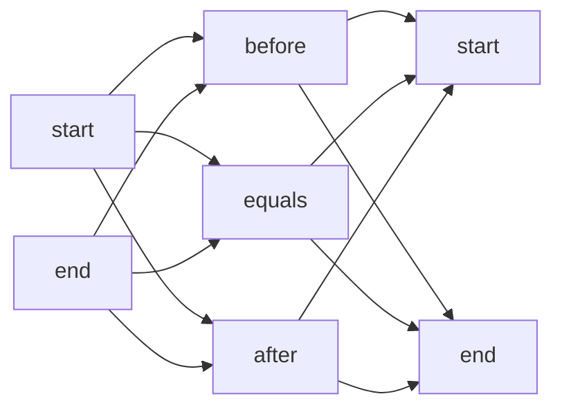

+++
title = "Reasonable Time Ontology"
outputs = ["Reveal"]
+++

# Reasonable Time Ontology

Giacomo Cavalieri - Nicolò Di Domenico

---

# Obiettivi

Prendendo come punto di partenza la modellazione fatta dall'ontologia TEO \
abbiamo realizzato l'ontologia ReTO con l'obiettivo di:

- Realizzare un'ontologia per una _rappresentazione strutturata delle_ \
  _informazioni temporali_
- Uniformare la rappresentazione di entità temporali
- Permettere _reasoning automatico_ sulle relazioni fra eventi temporali

---

# Alcuni esempi

L'**ambito medico** è un campo in cui poter ragionare automaticamente \
sulle *relazioni* fra eventi temporali può essere molto utile

Alcuni esempi che potrebbero beneficiare di un'ontologia per il tempo:
* Individuazione più efficace di *reazioni avverse*
* Predizione del *rischio di insorgenza* di determinate malattie
* Studio del *decorso* di una malattia

---

# Ontologie utilizzate

- `OWL Time Ontology` per collegare i concetti di istante e intervallo
- `Temporal Ontology` per sfruttare i predicati `before` e `after` \
  nella realizzazione delle regole SWRL
- `SWRLX` per permettere la creazione di nuovi individui durante il \
  processo di reasoning

---

# Alcune statistiche

| Metrics               | Count |
| --------------------- | ----- |
| _Axiom_               | 1582  |
| _Logical axiom_       | 540   |
| _Declaration axiom_   | 156   |
| _Class_               | 48    |
| _Object property_     | 70    |
| _Data property_       | 29    |
| _Individual_          | 28    |
| _Annotation property_ | 23    |

---

Tutte le nuove classi e proprietà introdotte sono state \
etichettate con `rdfs:label` e descritte tramite `skos:definition` \
e `rdfs:comment` sia in italiano che in inglese

Inoltre sono state realizzate oltre 30 regole SWRL per permettere \
un'efficace inferenza temporale

---

# Eventi
L'ontologia rimane volutamente _generica sulla tipologia di eventi trattati:_ \
il fulcro centrale è la gestione di concetti temporali

Chi utilizza l'ontologia sceglierà poi quali sottoclassi di `Event` \
realizzare a seconda del bisogno. Un evento potrebbe essere:

- L'avvenuta vaccinazione di un paziente
- La prescrizione di un farmaco
- La rilevazione di una scossa di terremoto
- L'inizio del processo di stagionatura di un formaggio

---

# Intervalli temporali

Il concetto chiave è quello di **intervallo temporale** (`TimeInterval`)

Ogni intervallo ha un *istante d'inizio* e/o un *istante di fine*: \
se manca uno dei due estremi, l'intervallo è *aperto*

Si divide in:
* Intervallo **assoluto** (`AbsoluteInterval`)
* Intervallo **relativo** (`RelativeInterval`)
* Intervallo **approssimato** (`FuzzyInterval`)

---

## Intervalli assoluti

Un **intervallo assoluto** (`AbsoluteInterval`) è un intervallo \
i cui estremi sono *istanti assoluti*, quindi *ben fissati sulla linea temporale*

### Esempi

- Dall'**11 ottobre 1998 alle 10:00:00**  
  al **5 novembre 2022 alle 12:54:15**
- Dal **28 settebre 1998 alle 14:32:26**
- Fino al **5 novembre 2002 alle 12:54:15**

---

## Intervalli relativi

Un **intervallo relativo** (`RelativeInterval`) è un intervallo \
in cui almeno uno dei due estremi è un *istante relativo* a uno assoluto

### Esempi

- Da **ieri a mezzanotte** (relativo a ora) fino a **ora** (assoluto)
- Fino a **due giorni fa** (relativo a ora)

---

## Intervalli approssimati

Un **intervallo approssimato** (`FuzzyInterval`) è un intervallo \
in cui almeno uno dei due estremi è un *istante approssimato*, \
cioè contenuto in un *intervallo di incertezza*

### Esempi

- Dalle **9 di mattina** (relativo a ora)  
  fino al **tardo pomeriggio** (approssimato)
- Dalla **prima settimana di settembre** (approssimato)  
  fino al **21 settembre 2022** (assoluto)

---

# Istanti temporali

Un **istante temporale** (`TimeInstant`) rappresenta un'entità temporale \
che denota un preciso momento nel tempo *di durata nulla*

Un istante non è altro che un *intervallo* i cui istanti di inizio e fine coincidono: \
questa equivalenza *semplifica notevolmente* le regole per effettuare il reasoning

Analogamente agli intervalli, si divide in:
* Istante **assoluto** (`AbsoluteInstant`)
* Istante **relativo** (`RelativeInstant`)
* Istante **approssimato** (`FuzzyInstant`)

---

## Istanti assoluti

Un **istante assoluto** (`AbsoluteInstant`) è un istante \
ben fissato sulla linea temporale

### Esempi

- **11 ottobre 1998 alle 10:00:00**
- **5 novembre 2022 alle 12:54:15**

---

## Istanti relativi

Un **istante relativo** (`RelativeInstant`) è un istante \
definito in termini di distanza da un istante assoluto (detto *àncora*)

La distanza di un istante relativo dalla sua àncora viene indicata tramite un `TimeDelta`, \
che contiene una *dimensione numerica* e la sua *granularità*

### Esempi

- **10 giorni dopo** (distanza 10, granularità giorno)  
  l'**11 ottobre 1998 alle 10:00:00** (àncora)
- **3 ore prima** (distanza 3, granularità ora) del ricovero  
  in ospedale il **5 novembre 2022 alle 12:54:15** (àncora)

---

## Istanti approssimati

Un **istante approssimato** (`FuzzyInstant`) è un istante \
contenuto in un *intervallo di incertezza*

### Esempi

- **Verso le 9 di mattina** (fra le 8:00:00 e le 10:00:00)
- **All'inizio del mese** (fra l'1 e il 10)

---

# Relazioni temporali

Le **relazioni temporali** possono essere stabilite fra due *entità temporali qualsiasi,* \
a prescindere dal fatto che siano istanti o intervalli

Si dividono in:
* Relazioni temporali *elementari*
* Relazioni temporali *di Allen*

---

## Relazioni temporali elementari

Le relazioni temporali di base permettono di stabilire \
_legami fra intervalli_ anche nel caso in cui questi siano aperti \
mettendo in relazione i tempi dei loro estremi




---

## Relazioni temporali di Allen

Partendo dalle dodici relazioni temporali elementari, \
si possono definire le tredici **relazioni temporali di Allen** \
fra due entità temporali $T_1$ e $T_2$

| Relazione | Inverso       | Definizione                                     |
| --------- | ------------- | ----------------------------------------------- |
| Before    | After         | $T_1$ avviene prima di $T_2$ senza sovrapporsi  |
| Meet      | Met by        | $T_1$ finisce quando inizia $T_2$               |
| Overlaps  | Overlapped by | $T_1$ si sovrappone almeno parzialmente a $T_2$ |
| Contains  | During        | $T_1$ contiene completamente $T_2$              |
| Starts    | Started by    | $T_1$ inizia quando inizia $T_2$                |
| Finishes  | Finished by   | $T_1$ finisce quando finisce $T_2$              |
| Equals    | -             | $T_1$ e $T_2$ coincidono                        |

---

# Regole SWRL

Per permettere ragionamento automatico efficace sulle relazioni fra eventi \
temporali sono state realizzate diverse regole SWRL che permettono \
di _inferire sia le relazioni temporali elementari, sia quelle di Allen_

Per ridurre il numero di regole da realizzare sono state effettuate delle \
conversioni che permettono di _ridurre ogni entità temporale al_ \
_corrispondente intervallo assoluto_

---

## Conversione da istante relativo ad assoluto

```prolog
   :RelativeInstant(?instant)
 ^ :hasPrefixAnchor(?instant, ?anchor)
 ^ :hasDateTime(?anchor, ?anchorTimestamp)
 ^ :hasTimeDelta(?instant, ?delta)
 ^ :hasDeltaUnitType(?delta, time:unitDay)
 ^ :deltaNumericDuration(?delta, ?deltaDurationDays)
 ^ swrlb:multiply(?deltaDurationSecondsDecimal, ?deltaDurationDays, 86400)
 ^ swrlb:round(?deltaDurationSeconds, ?deltaDurationSecondsDecimal)
 ^ temporal:add(?absoluteTime, ?anchorTimestamp, ?deltaDurationSeconds, "Seconds")
-> :AbsoluteInstant(?instant)
 ^ :hasDateTime(?instant, ?absoluteTime)
```

---

## Conversione da istante assoluto a intervallo

Un istante assoluto è un intervallo assoluto che ha *l'istante stesso* \
come inizio e come fine

```prolog
   :AbsoluteInstant(?i)
-> :hasEnd(?i, ?i)
 ^ :AbsoluteInterval(?i)
 ^ :hasBeginning(?i, ?i)
```

---

## Relazioni temporali elementari

$\forall T_1, T_2 . \[hasBeginning(T_1, B_1) \land hasEnd(T_2, E_2) \land B_1 < E_2 \]$ \
$\Rightarrow startBeforeEnd(T_1, T_2)$ 

```prolog
   :hasBeginning(?a, ?aAnchor)
 ^ :hasEnd(?b, ?bAnchor)
 ^ :hasDateTime(?aAnchor, ?aTimeStamp)
 ^ :hasDateTime(?bAnchor, ?bTimeStamp)
 ^ temporal:before(?aTimeStamp, ?bTimeStamp)
-> :startBeforeEnd(?a, ?b)
```

---

## Relazioni temporali di Allen

$$
\begin{align}
\forall\ T_1,T_2\quad before(T_1, T_2) \iff & startBeforeStart(T_1, T_2) \\\\
& \land endBeforeEnd(T_1, T_2) \\\\
& \land startBeforeEnd(T_1, T_2) \\\\
& \land endBeforeStart(T_1, T_2) \\\\
\end{align}
$$

L'implicazione $\Rightarrow$ può essere realizzata direttamente in *OWL* \
grazie all'uso di `subPropertyOf`

Tuttavia, per implementare l'implicazione $\Leftarrow$ è necessario \
ricorrere a regole *SWRL*

```prolog
   :startBeforeStart(?a, ?b)
 ^ :endBeforeEnd(?a, ?b)
 ^ :startBeforeEnd(?a, ?b)
 ^ :endBeforeStart(?a, ?b)
-> :before(?a, ?b)
```

---

## Calcolo della durata di un intervallo

Per ogni intervallo ne viene _calcolata la durata_ per permettere di \
realizzare delle query su questo aspetto

Per poter aggiungere l'individuo che contiene la durata dell'intervallo \
è stato utilizzato il builtin `swrlx:makeOWLThing`

```prolog
   :hasBeginning(?i, ?iBeginning)
 ^ :hasEnd(?i, ?iEnd)
 ^ :hasDateTime(?iBeginning, ?iBeginningTimeStamp)
 ^ :hasDateTime(?iEnd, ?iEndTimeStamp)
 ^ temporal:duration(?seconds, ?iBeginningTimeStamp, ?iEndTimeStamp, "Seconds")
 ^ swrlx:makeOWLThing(?d, ?i)
-> time:Duration(?d)
 ^ :hasDuration(?i, ?d)
 ^ time:unitType(?d, time:unitSecond)
 ^ time:numericDuration(?d, ?seconds)
```

---

## Conversioni di durate temporali

Le durate sono calcolate automaticamente in secondi, ma potrebbe essere \
utile poter interrogare su _granularità diverse_ delle durate degli intervalli \

Per questo sono state implementate diverse regole che realizzano in automatico \
le conversioni a diverse granularità (minuti, giorni, anni, ...)

```prolog
   :hasDuration(?i, ?d)
 ^ time:Duration(?d)
 ^ time:unitType(?d, time:unitSecond)
 ^ time:numericDuration(?d, ?seconds)
 ^ swrlb:divide(?days, ?seconds, 86400)
 ^ swrlx:makeOWLThing(?dDays, ?d)
-> time:Duration(?dDays)
 ^ :hasDuration(?i, ?dDays)
 ^ time:unitType(?dDays, time:unitDay)
 ^ time:numericDuration(?dDays, ?days)
```

---

# Query SPARQL

---

## Query 1

Il Caseificio Mambelli ha ricevuto un grande ordine di formaggi stagionati da parte \
di una delle catene di supermercati che rifornisce che si vuole preparare \
per il periodo natalizio

I titolari vogliono sapere _quanti dei formaggi attualmente in invecchiamento_ \
_saranno pronti prima della scadenza per il completamento dell’ordine_ \
in modo da adeguare la propria produzione per tempo

```sparql
SELECT (COUNT(?agingCheese) AS ?availableUnits)
WHERE {
  ?agingCheese
    rdf:type cheese:Cheese;
    cheese:hasAging / cheese:hasAgingInterval / reto:endBeforeEnd :scadenzaOrdine.
}
```

---

## Query 2

Il Teatro Bonci di Cesena vuole _valutare l’efficacia della propria nuova campagna_ \
_pubblicitaria_ per la stagione di abbonamenti del 2022

La nuova campagna è stata avviata a metà della stagione, dunque si vuole vedere\
_quanti abbonamenti sono stati venduti prima e dopo l’avvio della campagna_

```sparql
SELECT (COUNT(?b) AS ?before) (COUNT(?a) AS ?after)
WHERE {
  {
    ?seasonTicket rdf:type bonci:SeasonTicket;
                  :hasValidTime ?b.
    ?b :during bonci:campagnaAbbonamenti2022;
       :before bonci:nuovaPubblicita.
  } UNION {
    ?seasonTicket rdf:type bonci:SeasonTicket;
                  :hasValidTime ?a.
    ?a :during bonci:campagnaAbbonamenti2022;
       :after bonci:nuovaPubblicita.
  }
}
```

---

## Query 3

L'Agenzia Italiana del Farmaco sta seguendo gli studi di Fase 3 \
per dare l'approvazione del nuovo vaccino bivalente BA.4/BA.5 contro il virus SARS-Cov-2, \
e vuole analizzare *tutte le segnalazioni* di *episodi avversi* avvenuti *in seguito alla vaccinazione*

```sparql
SELECT ?patient ?accident ?vaccTime ?accidentTime
WHERE {
  ?patient :subjectOf ?vaccination;
           :subjectOf ?accident.
  ?accident rdf:type medical:PatientAccident;
            :hasValidTime ?accidentTime.
  ?vaccination rdf:type medical:Vaccination;
               :hasValidTime ?vaccTime;
               medical:withVaccine [
                 medical:against "SARS-Cov-2";
                 medical:variant "BA.4", "BA.5"
               ].
  ?accidentTime :after ?vaccTime.
}
```

---

## Query 4

L'ISTAT sta compilando la _classifica di qualità della vita_ nelle province\
italiane per l'anno 2021 e uno degli indicatori utilizzati per stilare\
tale classifica è il numero di denunce presentate per provincia

```sparql
SELECT ?province ?provinceLabel (COUNT(?complaint) AS ?complaints)
WHERE {
    ?complaint rdf:type legal:Denuncia;
               legal:in ?city;
               :hasValidTime / :during istat:anno2021.

    SERVICE <https://dbpedia.org/sparql> {
        ?city dbo:province ?province.
        OPTIONAL {
            ?province rdfs:label ?provinceLabel
            FILTER(LANG(?provinceLabel) = "it")
        }
    }
} GROUP BY ?province ?provinceLabel
```
